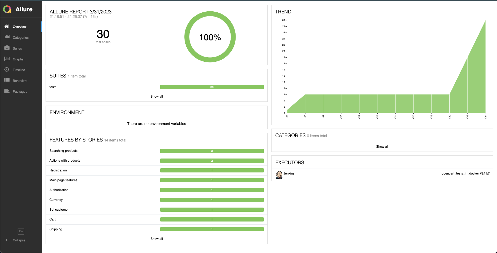
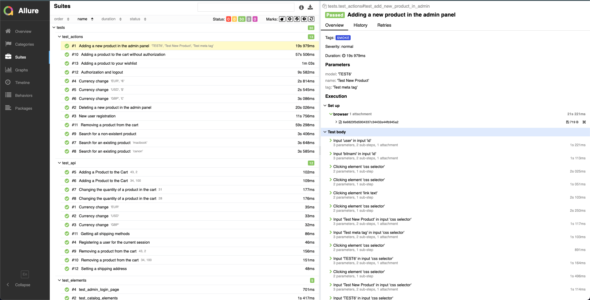
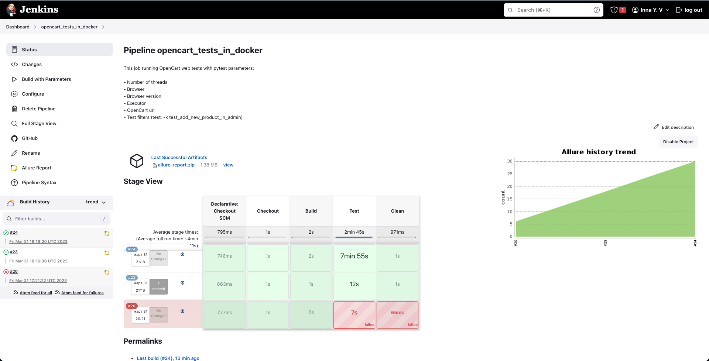

## Continuous automation of UI and API testing of a web application based on Jenkins, Docker and Allure.

__________

The repository was created as part of the tutorial "Python QA Engineer" from [Otus](https://otus.ru/).

Developed by UI and API tests for the [Opencart](https://www.opencart.com/index.php?route=common/home) service
using the PageObject pattern.

The framework provides for running tests both locally and using Selenoid, which is launched in Docker.
CI are organized through Docker and Jenkins.

### Technology stack:

- Python
- Selenium
- Pytest
- Requests
- Selenoid
- **Reporting**: Allure
- **CI**: Docker, Jenkins

_____

#### Run Commands:

- Docker:
    - `docker build -t <tests_image> .`
    - `docker run --name <tests_container> <tests_image> <pytests parameters>  `
- Jenkins:
    - `docker run -d -v jenkins_home:/var/jenkins_home -v /var/run/docker.sock:/var/run/docker.sock -p 9999:8080 -p 50000:50000 --restart=on-failure jenkins/jenkins:lts-jdk11`

      > Notes: to create an [Opencart API session](https://docs.opencart.com/en-gb/system/users/api/), you need environment variables in the .env
      file(to run locally). This file was not uploaded to the repository.
      For
      example:
      `API_USER="Test" and
      API_KEY="TLZzfSybwP42DZ"`. And also these same variables need to be added to Jenkins global variables (to run the Jenkins pipeline).

______
**Allure report example:**

**Jenkins pipline example:**

________
Project started with Python version 3.9.7 and selenium 4.6.0

